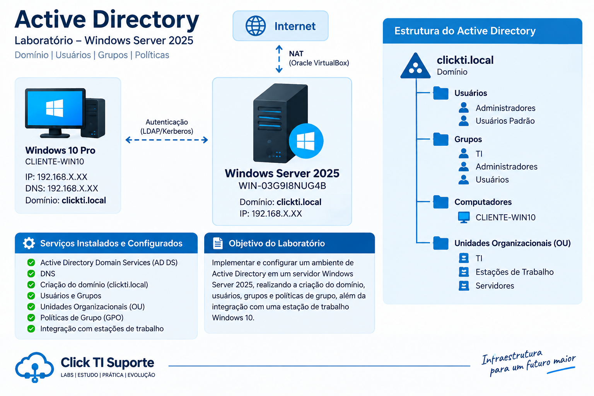

# Active Directory




## Visão geral

O Active Directory Domain Services (AD DS) foi instalado no Windows Server 2025 para centralizar a autenticação, o gerenciamento de usuários, grupos, computadores e recursos do ambiente.

O servidor foi configurado como **Domain Controller** e responsável pelos serviços de domínio e DNS do laboratório.

## Domínio

```text
Domínio: clickti.local
NetBIOS: CLICKTI
