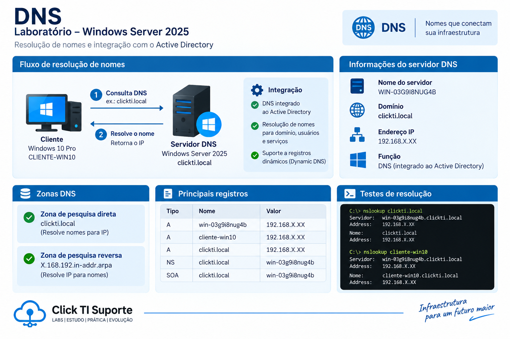

# DNS



## Visão geral

O serviço DNS foi configurado no Windows Server 2025 como parte da infraestrutura do domínio `clickti.local`.

O DNS é integrado ao Active Directory e é utilizado para resolução de nomes dentro do ambiente de laboratório.

## Configuração

```text
Servidor DNS: 192.168.X.XX
Domínio: clickti.local
Rede: 192.168.X.XX
