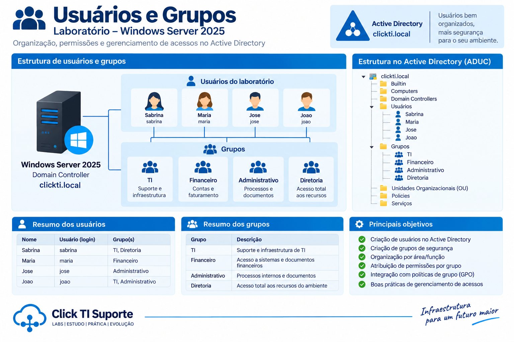
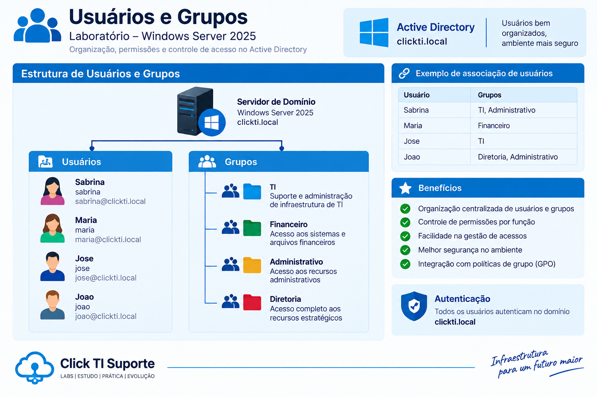

# Usuários e Grupos



## Visão geral

Para simular um ambiente corporativo, foram criados usuários e grupos de segurança no Active Directory.

A utilização de grupos permite organizar os usuários por departamento e facilitar o gerenciamento das permissões de acesso aos recursos da rede.



## Usuários

Foram criados os seguintes usuários:

| Usuário | Departamento | Grupo |
|---|---|---|
| Sabrina | TI | TI |
| Maria | Financeiro | Financeiro |
| Jose | Administrativo | Administrativo |
| Joao | Diretoria | Diretoria |

## Grupos de segurança

Foram criados grupos de segurança para representar os departamentos da organização:

| Grupo | Finalidade |
|---|---|
| TI | Usuários do departamento de Tecnologia da Informação |
| Financeiro | Usuários do departamento Financeiro |
| Administrativo | Usuários do departamento Administrativo |
| Diretoria | Usuários da Diretoria |

## Associação dos usuários aos grupos

Cada usuário foi associado ao grupo correspondente ao seu departamento.

```text
Sabrina → TI
Maria   → Financeiro
Jose    → Administrativo
Joao    → Diretoria
