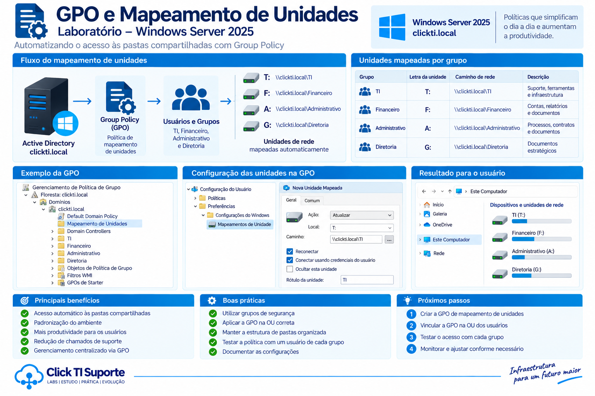

# GPO - Mapeamento de Unidades de Rede



## Visão geral

Foram configuradas Group Policy Objects (GPOs) no Windows Server 2025 para realizar automaticamente o mapeamento das pastas compartilhadas nos computadores dos usuários.

O objetivo é disponibilizar os recursos de rede de acordo com o departamento ao qual o usuário pertence.

## GPOs configuradas

Foram criadas quatro GPOs:

| GPO | Grupo | Unidade | Compartilhamento |
|---|---|---|---|
| Mapeamento TI | TI | T: | `\\192.168.X.XX\TI` |
| Mapeamento Financeiro | Financeiro | F: | `\\192.168.X.XX\Financeiro` |
| Mapeamento Administrativo | Administrativo | A: | `\\192.168.X.XX\Administrativo` |
| Mapeamento Diretoria | Diretoria | G: | `\\192.168.X.XX\Diretoria` |

> Os endereços IP foram ocultados nesta documentação por se tratar de um repositório público.

## Configuração das GPOs

As GPOs foram vinculadas ao domínio:

```text
clickti.local
```

A configuração foi realizada em:

```text
Configuração do Usuário
└── Preferências
    └── Configurações do Windows
        └── Mapas de Unidades
```

Cada GPO utiliza a opção **Update** para criar ou atualizar a unidade de rede no perfil do usuário.

A opção **Reconnect** também foi habilitada para manter o mapeamento após novos logons.

## Filtro de segurança

O filtro de segurança foi configurado utilizando os grupos do Active Directory.

Exemplo:

```text
Mapeamento TI
└── Grupo: TI

Mapeamento Financeiro
└── Grupo: Financeiro

Mapeamento Administrativo
└── Grupo: Administrativo

Mapeamento Diretoria
└── Grupo: Diretoria
```

Além do grupo responsável pelo acesso, o grupo **Computadores do domínio** possui permissão de leitura para permitir o processamento da GPO no ambiente.

## Funcionamento

O processo funciona da seguinte maneira:

```text
Usuário faz logon
        ↓
Active Directory identifica os grupos
        ↓
GPO é processada
        ↓
Grupo correspondente é identificado
        ↓
Unidade de rede é mapeada
        ↓
Usuário acessa o compartilhamento autorizado
```

## Mapeamento por usuário

### Sabrina

Usuária pertencente ao grupo **TI**.

```text
T: → Compartilhamento TI
```

A usuária não possui acesso aos compartilhamentos dos demais departamentos.

### Maria

Usuária pertencente ao grupo **Financeiro**.

```text
F: → Compartilhamento Financeiro
```

A usuária não possui acesso aos compartilhamentos dos demais departamentos.

### Jose

Usuário pertencente ao grupo **Administrativo**.

```text
A: → Compartilhamento Administrativo
```

O usuário não possui acesso aos compartilhamentos dos demais departamentos.

### Joao

Usuário pertencente ao grupo **Diretoria**.

```text
G: → Compartilhamento Diretoria
```

O usuário possui acesso aos compartilhamentos definidos para a Diretoria, incluindo os recursos dos demais departamentos conforme as permissões configuradas no laboratório.

## Validação das GPOs

Foram utilizados comandos de diagnóstico do Windows para verificar a aplicação das políticas de grupo.

Exemplo:

```text
gpresult /r
```

O resultado foi utilizado para confirmar quais GPOs foram aplicadas ao usuário.

Também foram realizados testes diretamente no Explorador de Arquivos para validar a presença das unidades de rede.

## Testes realizados

- [x] Criação da GPO de mapeamento da TI
- [x] Criação da GPO de mapeamento do Financeiro
- [x] Criação da GPO de mapeamento do Administrativo
- [x] Criação da GPO de mapeamento da Diretoria
- [x] Configuração dos filtros de segurança
- [x] Configuração das preferências de mapeamento de unidades
- [x] Atualização das políticas de grupo
- [x] Validação com `gpresult`
- [x] Teste com usuário da TI
- [x] Teste com usuário do Financeiro
- [x] Teste com usuário do Administrativo
- [x] Teste com usuário da Diretoria
- [x] Validação do acesso aos compartilhamentos

## Resultado

As GPOs foram configuradas com sucesso para automatizar o mapeamento das unidades de rede.

O uso de grupos do Active Directory permite que os recursos sejam disponibilizados automaticamente conforme o departamento do usuário.

Essa abordagem reduz a necessidade de configuração manual nas estações de trabalho e facilita a administração centralizada do ambiente.
