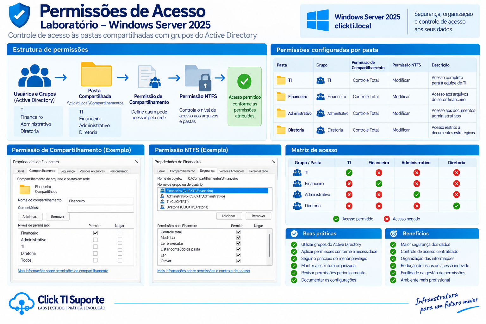

# Permissões e Controle de Acesso

## Visão geral

O controle de acesso aos recursos compartilhados foi implementado utilizando grupos de segurança do Active Directory e permissões de segurança do Windows Server 2025.

O objetivo é garantir que cada usuário tenha acesso somente aos recursos necessários para sua função dentro do ambiente corporativo.

## Grupos utilizados

Foram criados grupos de segurança para representar os departamentos da organização:

| Grupo | Departamento |
|---|---|
| TI | Tecnologia da Informação |
| Financeiro | Financeiro |
| Administrativo | Administrativo |
| Diretoria | Diretoria |

## Usuários e grupos

Os usuários foram associados aos respectivos grupos do Active Directory:

| Usuário | Grupo |
|---|---|
| Sabrina | TI |
| Maria | Financeiro |
| Jose | Administrativo |
| Joao | Diretoria |

## Estrutura de permissões

As permissões foram aplicadas às pastas compartilhadas de acordo com os grupos do Active Directory.

```text
C:\Compartilhamentos\
│
├── TI
│   └── Grupo: TI
│
├── Financeiro
│   └── Grupo: Financeiro
│
├── Administrativos
│   └── Grupo: Administrativo
│
└── Diretoria
    └── Grupo: Diretoria
```



## Controle de acesso

O acesso aos recursos foi definido de acordo com a função de cada usuário.

Os usuários dos departamentos possuem acesso ao seu respectivo compartilhamento.

O grupo **Diretoria** possui acesso aos recursos dos demais departamentos, conforme definido na configuração do laboratório.

## Matriz de acesso

| Usuário | TI | Financeiro | Administrativo | Diretoria |
|---|---|---|---|---|
| Sabrina | ✅ | ❌ | ❌ | ❌ |
| Maria | ❌ | ✅ | ❌ | ❌ |
| Jose | ❌ | ❌ | ✅ | ❌ |
| Joao | ✅ | ✅ | ✅ | ✅ |

Legenda:

- ✅ Acesso permitido
- ❌ Acesso negado

## Permissões NTFS e SMB

O controle de acesso foi realizado considerando as permissões do compartilhamento e as permissões de segurança da pasta no sistema de arquivos NTFS.

As permissões foram configuradas através da interface gráfica do Windows Server.

O uso conjunto dessas permissões permite controlar o acesso aos arquivos armazenados no servidor.

## Testes realizados

Foram realizados testes utilizando os diferentes usuários do domínio.

### Sabrina - TI

Foi realizado login com o usuário `Sabrina`.

Resultado:

```text
Acesso permitido:
TI

Acesso negado:
Financeiro
Administrativo
Diretoria
```

### Maria - Financeiro

Foi realizado login com o usuário `Maria`.

Resultado:

```text
Acesso permitido:
Financeiro

Acesso negado:
TI
Administrativo
Diretoria
```

### Jose - Administrativo

Foi realizado login com o usuário `Jose`.

Resultado:

```text
Acesso permitido:
Administrativo

Acesso negado:
TI
Financeiro
Diretoria
```

### Joao - Diretoria

Foi realizado login com o usuário `Joao`.

Resultado:

```text
Acesso permitido:
TI
Financeiro
Administrativo
Diretoria
```

## Validação

Os testes confirmaram que o controle de acesso está funcionando conforme planejado.

Cada usuário recebe acesso aos recursos de acordo com o grupo do Active Directory ao qual pertence.

A Diretoria possui privilégios adicionais para acessar os recursos dos demais departamentos.

## Boas práticas aplicadas

- Utilização de grupos para controle de acesso.
- Evitar atribuição de permissões individualmente aos usuários.
- Separação dos recursos por departamento.
- Validação do acesso através de usuários de teste.
- Aplicação de permissões através do Windows Server.
- Utilização do Active Directory para gerenciamento centralizado.
- Utilização de GPO para automatizar o acesso às unidades de rede.

## Resultado

O ambiente demonstrou na prática o funcionamento do controle de acesso baseado em grupos do Active Directory.

A combinação de Active Directory, grupos de segurança, permissões NTFS, compartilhamentos SMB e GPO permite criar um ambiente organizado e administrável, semelhante ao encontrado em pequenas e médias empresas.
